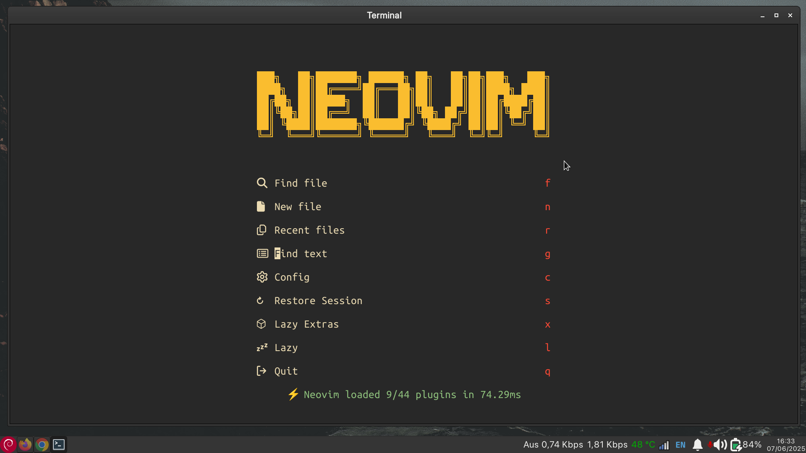

# My Neovim Config ✨

This is my Neovim configuration utilizing the [**LazyVim**](https://github.com/LazyVim/LazyVim) plugin manager to streamline plugin management and configuration. It integrates AI-powered tools like [**Gemini**](https://github.com/kiddos/gemini.nvim) & [**Avante**](https://github.com/yetone/avante.nvim) 🤖 to enhance the coding experience with intelligent code suggestions, seamless auto-completion and improved productivity 🚀.

